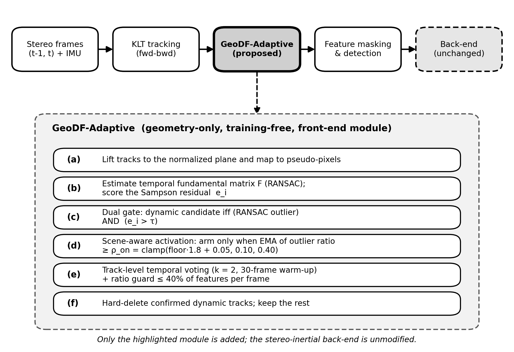
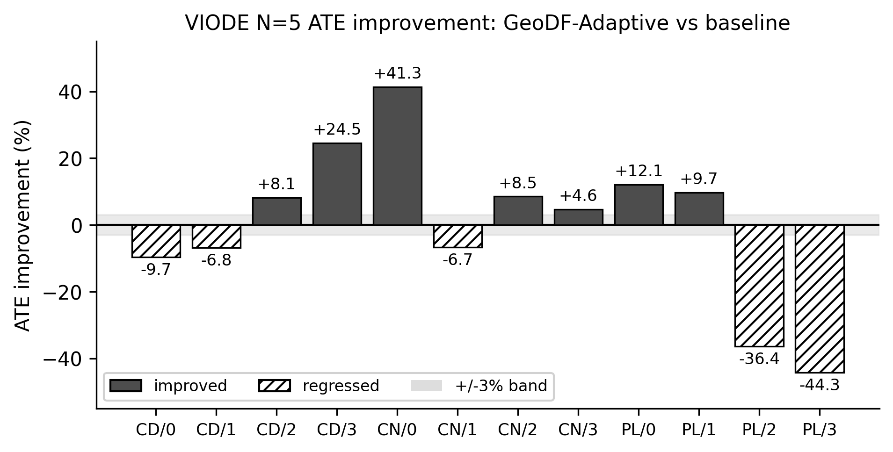
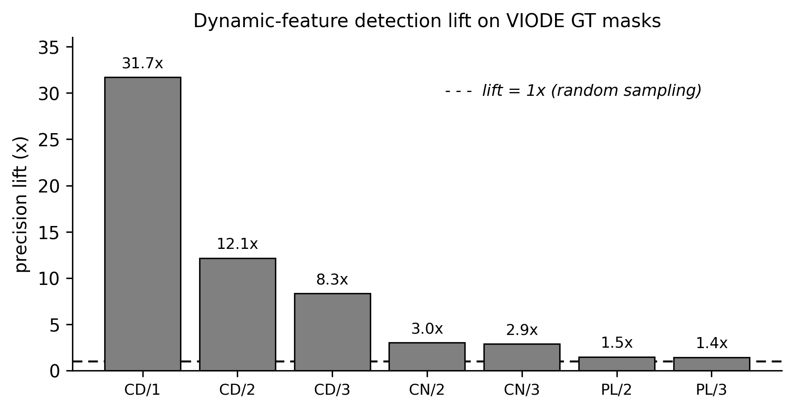

# GeoDF-Adaptive VINS: AECE Manuscript Draft

Target journal: **Advances in Electrical and Computer Engineering (AECE)**,
Stefan cel Mare University of Suceava. This draft is written as a source
document to be converted into the official AECE Microsoft Word `.doc` template.

AECE-specific constraints to respect:

- Manuscript format: native Microsoft Word `.doc` using the AECE template.
- Page count: even number of pages: 8, 10, or 12. Target 8 pages first.
- Keywords: five keywords or phrases, alphabetically ordered.
- Review: double-blind. Remove author names/affiliations from the submitted
  review copy if the AECE submission workflow requires blind files.
- References: include permanent links, preferably DOI/CrossRef links, where
  available.
- APC: 300 EUR for accepted papers, plus 25 EUR per page beyond 8 pages
  according to the current AECE author information page.

## Proposed Title

GeoDF-Adaptive: Geometry-Based Dynamic Feature Rejection for Stereo-Inertial
Visual Odometry in Dynamic Scenes

## Abstract

Dynamic objects violate the static-scene assumption used by feature-based
visual-inertial odometry. This paper presents GeoDF-Adaptive, a geometry-based
front-end dynamic feature rejection method for stereo-inertial VINS. The method
uses temporal epipolar consistency, a Sampson residual dual gate, scene-aware
activation, auto-calibrated activation thresholding, and track-level temporal
voting. Unlike semantic approaches, GeoDF-Adaptive does not require an object
detector, a segmentation model, or dataset-specific training. The method was
implemented in a VINS-Fusion stereo-inertial pipeline and evaluated on the
original EuRoC and VIODE datasets. On EuRoC, GeoDF-Adaptive preserved
static-scene accuracy and improved ATE RMSE by 2.0% to 6.2% on all five tested
sequences. On VIODE, it improved ATE in 7 of 12 evaluated environment-level
conditions under a +/-3% decision band, including +24.5% on `city_day/3_high`
and +41.3% on `city_night/0_none`. A feature-level evaluation using VIODE
moving-vehicle segmentation masks showed that rejected features in `city_day`
were 8.33x to 31.72x more likely to lie on dynamic objects than random tracked
features, while the static-feature false positive rate stayed below 1%.
However, high dynamic-density parking-lot scenes remained a limitation because
large moving regions can contaminate the fundamental matrix estimate. The
module is lightweight: its measured per-frame cost averaged 0.28 ms on a
CPU-only host, about 0.56% of the 20 Hz frame budget. The results support
GeoDF-Adaptive as a reproducible geometry-only baseline for dynamic-scene
stereo-inertial visual odometry.

## Keywords

computer vision, dynamic feature rejection, sensor fusion, stereo-inertial
odometry, visual odometry

## 1. Introduction

Visual-inertial odometry (VIO) estimates camera motion by combining visual
feature observations with inertial measurements. It is a core component in
mobile robots, unmanned vehicles, augmented reality, and autonomous navigation
systems. Many practical VIO front-ends, including feature-based stereo-inertial
pipelines, rely on the assumption that most tracked visual features belong to a
static rigid scene. This assumption is frequently violated in real or simulated
traffic environments where moving vehicles, pedestrians, and other dynamic
objects produce image motion that is inconsistent with camera ego-motion.

Dynamic-scene VIO is commonly addressed by semantic segmentation, object
detection, motion segmentation, robust estimation, or combinations of these
techniques. Semantic methods can be effective, but they introduce model
dependency, computational load, and dataset or domain assumptions. In contrast,
geometry-based methods remain attractive for applied engineering systems because
they are reproducible, lightweight in design, and do not require model training.
However, a purely geometric dynamic-feature filter must avoid two failure modes:
removing useful static features in static scenes and over-trusting a
contaminated geometric model when dynamic objects dominate the image.

This paper investigates a geometry-only front-end filter, called
GeoDF-Adaptive, for stereo-inertial VINS. The method uses temporal epipolar
geometry to identify features that are inconsistent with rigid-scene motion.
Unlike always-on filtering, GeoDF-Adaptive self-activates only when a smoothed
outlier signal exceeds an auto-calibrated scene threshold. Track-level temporal
voting is then used to reduce transient false positives caused by two-frame
epipolar noise, fast rotation, or short-term low parallax.

The contribution of this work is not a universal state-of-the-art dynamic VIO
system. Instead, it provides a focused engineering contribution: a simple
geometry-only feature rejection module, integrated into a stereo-inertial VINS
pipeline, and evaluated with both trajectory-level and feature-level metrics on
published datasets. The feature-level evaluation is important because trajectory
accuracy alone cannot reveal whether rejected points are actually located on
moving objects.

The main contributions are:

1. A geometry-only front-end dynamic feature rejection method for
   stereo-inertial VINS using temporal fundamental matrix estimation and Sampson
   residual dual gating.
2. A scene-aware activation mechanism with an auto-calibrated `rho_on`
   threshold derived from the running epipolar outlier floor.
3. A track-level temporal voting strategy that suppresses transient false
   positives before hard feature deletion.
4. A reproducible evaluation on EuRoC and VIODE, including ATE/RPE trajectory
   metrics and feature-level detection metrics against VIODE dynamic
   segmentation masks.
5. A limitation analysis showing that high dynamic-density scenes can still
   degrade the method when the fundamental matrix estimate is contaminated by
   large moving regions.

## 2. Related Work

Feature-based VIO systems such as VINS-Fusion estimate camera motion by
tracking image features and optimizing visual-inertial residuals. These systems
are efficient and accurate in static or mostly static scenes, but they can be
affected by dynamic features because those features violate the rigid-scene
model used by geometric constraints and visual bundle adjustment.

Classical robust estimation methods, including RANSAC and epipolar outlier
rejection, are often used to remove inconsistent correspondences. These
approaches are attractive because they are model-free and do not require
semantic labels. Nevertheless, they usually operate as generic outlier filters
rather than as adaptive dynamic-object filters. If the rejection threshold is
too low, useful static features are removed; if it is too high, moving-object
features remain in the estimator.

Semantic dynamic SLAM and VIO systems use object detectors or segmentation
networks to identify potentially dynamic regions. Methods such as DynaSLAM and
dynamic-object-aware VIO pipelines can remove features on cars or people more
directly than pure geometry. Their advantage is stronger object-level reasoning,
while their drawback is dependence on segmentation quality, computational
resources, and category definitions. They may also fail on unseen dynamic
classes or in image domains different from the training data.

GeoDF-Adaptive is positioned between generic robust estimation and semantic
dynamic filtering. It keeps the implementation in the VIO front-end and uses
only geometric consistency. Its goal is not to replace semantic filtering in all
cases, but to provide a reproducible engineering baseline for dynamic feature
rejection when training-free operation and easy integration are preferred.

### Table 1. Positioning Against Related Approaches

| Approach family | Uses semantics | Needs training/model | Front-end only | Main limitation |
|---|---:|---:|---:|---|
| Standard VINS-Fusion [1], [2] | no | no | yes | assumes mostly static scene |
| Generic RANSAC outlier rejection [7], [8] | no | no | yes | not scene-aware |
| Robust back-end dynamic VINS (DynaVINS) [6] | no | no | no | modifies back-end optimization |
| Semantic dynamic SLAM/VIO (DynaSLAM) [5] | yes | yes | varies | detector/segmentation dependency |
| GeoDF-Adaptive (this work) | no | no | yes | high dynamic density can corrupt F |

Standard feature-based VINS [1], [2] assumes a mostly static scene. Generic
robust estimation such as RANSAC [7] with epipolar/Sampson residuals [8]
removes inconsistent correspondences but is not scene-aware. Back-end methods
such as DynaVINS [6] add robustness inside the optimization, while semantic
methods such as DynaSLAM [5] rely on a detector or segmentation network.
GeoDF-Adaptive stays training-free and front-end only, trading object-level
reasoning for reproducibility and easy integration.

## 3. Proposed Method

GeoDF-Adaptive is inserted in the feature-tracking front-end after temporal KLT
tracking and before feature masking and new feature detection [10]. It operates
on features that have been tracked between two consecutive frames. Figure 1
shows where the module sits in the pipeline and its internal steps (a)-(f);
only this module is added and the stereo-inertial back-end is unmodified.



**Figure 1.** GeoDF-Adaptive front-end pipeline and internal steps (a)-(f).

### 3.1 Temporal Epipolar Consistency

For a tracked feature correspondence between frame `t-1` and frame `t`, the
left-camera image points are lifted to the normalized camera plane and mapped to
the pseudo-pixel space used by the VINS front-end. A fundamental matrix `F` is
estimated using RANSAC. For each tracked feature, the Sampson residual is
computed as

```text
e_i = ((x_i^T F x'_i)^2) /
      ((F x'_i)_1^2 + (F x'_i)_2^2 + (F^T x_i)_1^2 + (F^T x_i)_2^2)
```

where `x_i` and `x'_i` are the current and previous homogeneous feature
coordinates. A feature is considered a dynamic candidate only when it satisfies
both conditions: it is a RANSAC outlier and its Sampson residual is above the
configured threshold. This dual gate is used to avoid deleting features due to a
single weak signal.

### 3.2 Scene-Aware Activation

Always-on rejection can damage static or low-dynamic scenes. Therefore,
GeoDF-Adaptive maintains an exponential moving average of the frame outlier
ratio. The rejection module is armed only when this signal exceeds a threshold
`rho_on`. Instead of using a fixed threshold, the proposed method estimates a
running outlier floor for the current scene and computes

```text
rho_on = clamp(floor * 1.8 + 0.05, 0.10, 0.40)
```

The floor uses asymmetric smoothing: it adapts down faster when the observed
outlier ratio decreases and increases slowly when the ratio rises. This prevents
short dynamic bursts from inflating the static floor while allowing high-noise
scenes to use a more conservative activation threshold.

### 3.3 Track-Level Temporal Voting

Two-frame epipolar geometry can generate transient false positives under fast
rotation, low parallax, or weak texture. To reduce this effect, each feature ID
maintains a dynamic-candidate streak. A feature is eligible for hard deletion
only after being flagged for at least `k` consecutive frames. In the evaluated
configuration, `k=2` and a 30-frame warm-up period is used.

### 3.4 Integration in Stereo-Inertial VINS

GeoDF-Adaptive does not modify the back-end visual-inertial optimization. It
only removes selected feature tracks from the front-end before new feature
detection. This design keeps the estimator unchanged and makes the method easy
to integrate into an existing VINS-Fusion style pipeline. A per-frame ratio
guard additionally caps hard deletions at 40% of tracked features and never
reduces the active set below a minimum feature count, so the estimator is never
starved even if the gate over-fires.

### 3.5 Parameter Settings

All experiments used a single fixed configuration (no per-sequence tuning).
The stereo temporal cross-check was disabled in the evaluated configuration.

### Table: GeoDF-Adaptive Parameters (Evaluated Configuration)

| Parameter | Symbol / key | Value |
|---|---|---:|
| RANSAC reprojection threshold | `ransac_th_px` | 1.0 px |
| Sampson dynamic threshold | tau (`sampson_th`) | 3.0 |
| Min track count to score | `min_track_cnt` | 2 |
| Min features kept | `min_feature_num` | 40 |
| Outlier-ratio EMA factor | `activate_ema` | 0.15 |
| Auto threshold multiplier | `auto_mult` | 1.8 |
| Auto threshold margin | `auto_margin` | 0.05 |
| Arm threshold clamp | rho_on range | [0.10, 0.40] |
| Floor adapt-down / up rate | `floor_down` / `floor_up` | 0.02 / 0.004 |
| Disarm hysteresis fraction | `deactivate_frac` | 0.6 |
| Temporal voting frames | k (`vote_frames`) | 2 |
| Warm-up frames | `warmup_frames` | 30 |
| Max reject ratio (guard) | `max_reject_ratio` | 0.40 |

## 4. Experimental Setup

The method was evaluated on two datasets. EuRoC [3] was used as a static-scene
safety test because it contains indoor stereo-inertial sequences with accurate
ground truth. VIODE [4] was used as the dynamic-scene benchmark because it
provides stereo-inertial data, trajectory ground truth, and segmentation masks
for moving vehicles.

### 4.1 Datasets

The EuRoC evaluation used `MH_01_easy`, `MH_02_easy`, `MH_03_medium`,
`MH_04_difficult`, and `MH_05_difficult`. The VIODE evaluation used three
environments: `city_day`, `city_night`, and `parking_lot`. Each environment was
evaluated under four dynamic levels: `0_none`, `1_low`, `2_mid`, and `3_high`.

### 4.2 Metrics

Trajectory accuracy was measured using ATE RMSE and RPE RMSE in metres,
computed with the `evo` evaluation toolkit [9] after SE(3) alignment to ground
truth. For
VIODE, each reported value is the mean and standard deviation over five runs
within the same build. EuRoC static safety used repeated baseline and adaptive
runs as summarized in the project artifacts.

Feature-level detection was evaluated by matching tracked feature coordinates to
the nearest VIODE segmentation mask within 30 ms. A feature was labelled dynamic
when it fell inside a `vehicle_dynamic_*` mask. The main detection metrics were
precision lift, recall, and static false-positive rate.

### 4.3 Implementation and Runtime Measurement

The method was implemented in C++ inside a VINS-Fusion style stereo-inertial
pipeline (ROS 2). All experiments used a single consistent build. The
per-frame cost of the GeoDF-Adaptive module was logged for every processed
frame using the same in-pipeline timer (`t_geo`) so that the reported overhead
reflects the deployed code path rather than a separate micro-benchmark. Runtime
statistics were aggregated over all VIODE adaptive trials
(60 runs, 74,994 logged frames). The host machine was an Intel Xeon
W-11955M CPU (8 cores, 16 threads, 2.60 GHz) with 64 GB RAM, CPU-only, with no
GPU acceleration used by the front-end.

## 5. Results and Discussion

### 5.1 VIODE Trajectory Results

Table 2 summarizes the VIODE ATE/RPE results. GeoDF-Adaptive improved ATE in 7
of 12 conditions under a +/-3% decision band. The strongest gains were observed
in `city_day/3_high` and `city_night/0_none`.

### Table 2. VIODE N=5 Trajectory Summary

| Environment | Level | Baseline ATE | Proposed ATE | Improvement |
|---|---|---:|---:|---:|
| city_day | 0_none | 0.110 +/- 0.001 | 0.120 +/- 0.000 | -9.7% |
| city_day | 1_low | 0.138 +/- 0.001 | 0.148 +/- 0.014 | -6.8% |
| city_day | 2_mid | 0.166 +/- 0.000 | 0.152 +/- 0.009 | +8.1% |
| city_day | 3_high | 0.409 +/- 0.052 | 0.309 +/- 0.000 | +24.5% |
| city_night | 0_none | 0.420 +/- 0.002 | 0.246 +/- 0.000 | +41.3% |
| city_night | 1_low | 0.504 +/- 0.009 | 0.538 +/- 0.036 | -6.7% |
| city_night | 2_mid | 0.502 +/- 0.010 | 0.460 +/- 0.000 | +8.5% |
| city_night | 3_high | 0.875 +/- 0.018 | 0.835 +/- 0.026 | +4.6% |
| parking_lot | 0_none | 0.167 +/- 0.000 | 0.147 +/- 0.003 | +12.1% |
| parking_lot | 1_low | 0.118 +/- 0.000 | 0.106 +/- 0.000 | +9.7% |
| parking_lot | 2_mid | 0.144 +/- 0.000 | 0.197 +/- 0.013 | -36.4% |
| parking_lot | 3_high | 0.119 +/- 0.000 | 0.172 +/- 0.000 | -44.3% |

These results show that the method is conditionally effective rather than
universally superior. It helps when dynamic features produce clear geometric
inconsistency and do not dominate the image. It can degrade when the dynamic
object density is high enough to contaminate the fundamental matrix estimate.
Figure 2 visualizes the per-condition ATE change against the +/-3% decision
band.



**Figure 2.** VIODE N=5 ATE improvement of GeoDF-Adaptive over the baseline
(CD = city_day, CN = city_night, PL = parking_lot; 0-3 dynamic levels).

### 5.2 EuRoC Static Safety

Static-scene safety is important because a dynamic-feature filter should not
harm odometry in environments where dynamic objects are absent. On EuRoC,
GeoDF-Adaptive improved all five tested sequences by 2.0% to 6.2%, indicating
that scene-aware activation did not introduce a static-scene regression.

### Table 3. EuRoC Static Safety

| Sequence | Baseline ATE | Proposed ATE | Improvement |
|---|---:|---:|---:|
| MH_01_easy | 0.185 +/- 0.007 | 0.177 +/- 0.000 | +4.3% |
| MH_02_easy | 0.169 +/- 0.000 | 0.165 +/- 0.005 | +2.0% |
| MH_03_medium | 0.292 +/- 0.000 | 0.274 +/- 0.000 | +6.2% |
| MH_04_difficult | 0.447 +/- 0.000 | 0.436 +/- 0.007 | +2.3% |
| MH_05_difficult | 0.298 +/- 0.000 | 0.290 +/- 0.009 | +2.6% |

### 5.3 Feature-Level Dynamic Detection

Trajectory metrics alone cannot prove that a filter is removing dynamic-object
features. Therefore, the rejected features were compared against VIODE
moving-vehicle segmentation masks. On `city_day`, rejected features were 8.33x
to 31.72x more likely to fall on moving vehicles than randomly selected tracked
features, while the static false-positive rate stayed below 1%.

### Table 4. VIODE Dynamic Feature Detection

| Environment | Level | Dynamic base rate | Precision lift | Static FPR |
|---|---|---:|---:|---:|
| city_day | 1_low | 0.08% | 31.72x | 0.59% |
| city_day | 2_mid | 1.24% | 12.14x | 0.59% |
| city_day | 3_high | 4.10% | 8.33x | 0.71% |
| city_night | 2_mid | 2.0% | 3.02x | 0.8% |
| city_night | 3_high | 4.9% | 2.89x | 0.7% |
| parking_lot | 2_mid | 10.7% | 1.48x | 2.8% |
| parking_lot | 3_high | 14.0% | 1.42x | 3.0% |



**Figure 3.** Dynamic-feature detection lift on VIODE moving-vehicle masks. A
lift of 1x equals random sampling; higher is better.

The detection results explain both the success and the failure cases. In
`city_day`, the filter strongly concentrates rejections on moving vehicles. In
`parking_lot`, the dynamic base rate is much higher and the lift drops to about
1.4x. This indicates that the geometric separation between static and dynamic
features becomes weak when large moving regions affect the fundamental matrix.

### 5.4 Computational Overhead

Because the module is intended as a lightweight front-end addition, its runtime
cost was measured directly in the deployed pipeline. Over 74,994 logged frames
across all VIODE adaptive trials, the GeoDF-Adaptive step took a mean of
0.28 ms per frame (median 0.24 ms, 95th percentile 0.53 ms, 99th percentile
0.83 ms). At the 20 Hz image rate of the evaluated sequences, this corresponds
to about 0.56% of the 50 ms per-frame budget. The scene-aware gate kept the
hard-rejection path active on only 10.3% of frames, so on static or
low-dynamic stretches the dominant cost is a single fundamental matrix
estimation and Sampson scoring pass, while full rejection and temporal voting
run only when the smoothed outlier signal arms the module. These measurements
support describing GeoDF-Adaptive as a low-overhead, CPU-only front-end module
rather than relying on a qualitative claim.

### Table 5. Measured GeoDF-Adaptive Runtime (VIODE, CPU-only)

| Metric | Value |
|---|---:|
| Mean per-frame cost | 0.28 ms |
| Median per-frame cost | 0.24 ms |
| 95th percentile | 0.53 ms |
| 99th percentile | 0.83 ms |
| Fraction of 50 ms (20 Hz) budget | 0.56% |
| Frames with rejection armed | 10.3% |
| Logged frames | 74,994 (60 trials) |

### 5.5 Limitation Analysis

The main limitation is the majority-rigid assumption behind fundamental matrix
estimation. If dynamic features occupy large regions of the image, the estimated
model can be biased toward moving objects. In this case, the dual gate may
delete useful static features or fail to identify the correct dynamic set. The
`parking_lot` results confirm this limitation. Future work should combine the
current scene-aware activation with IMU-compensated epipolar scoring,
progressive or weighted fundamental matrix estimation, and scene-adaptive
hard/soft rejection.

## 6. Conclusion

This paper presented GeoDF-Adaptive, a geometry-only dynamic feature rejection
method for stereo-inertial visual odometry. The method combines temporal
epipolar consistency, Sampson residual gating, scene-aware activation,
auto-calibrated thresholding, and track-level temporal voting. Experiments on
EuRoC and VIODE show that the method preserves static-scene performance and
improves several moderate-dynamic VIODE cases. Feature-level evaluation using
VIODE moving-vehicle masks confirms that rejected features are substantially
more likely to belong to moving objects in favourable scenes. The method is not
universal, and high dynamic-density parking-lot scenes remain a limitation. The
results support GeoDF-Adaptive as a reproducible geometry-only baseline for
applied dynamic-scene VIO research.

## References

(IEEE numbered style, as used by AECE. DOIs verified; format the final list in
the AECE `.doc` template. The `evo` tool [9] has no DOI and is cited as a
software repository.)

[1] T. Qin, P. Li, and S. Shen, "VINS-Mono: A robust and versatile monocular
visual-inertial state estimator," *IEEE Transactions on Robotics*, vol. 34,
no. 4, pp. 1004-1020, 2018. DOI: 10.1109/TRO.2018.2853729

[2] T. Qin, J. Pan, S. Cao, and S. Shen, "A general optimization-based framework
for local odometry estimation with multiple sensors," *arXiv preprint*
arXiv:1901.03638, 2019.

[3] M. Burri, J. Nikolic, P. Gohl, T. Schneider, J. Rehder, S. Omari, M. W.
Achtelik, and R. Siegwart, "The EuRoC micro aerial vehicle datasets,"
*The International Journal of Robotics Research*, vol. 35, no. 10,
pp. 1157-1163, 2016. DOI: 10.1177/0278364915620033

[4] K. Minoda, F. Schilling, V. Wuest, D. Floreano, and T. Yairi, "VIODE: A
simulated dataset to address the challenges of visual-inertial odometry in
dynamic environments," *IEEE Robotics and Automation Letters*, vol. 6, no. 2,
pp. 1343-1350, 2021. DOI: 10.1109/LRA.2021.3058073

[5] B. Bescos, J. M. Facil, J. Civera, and J. Neira, "DynaSLAM: Tracking,
mapping, and inpainting in dynamic scenes," *IEEE Robotics and Automation
Letters*, vol. 3, no. 4, pp. 4076-4083, 2018. DOI: 10.1109/LRA.2018.2860039

[6] S. Song, H. Lim, A. J. Lee, and H. Myung, "DynaVINS: A visual-inertial SLAM
for dynamic environments," *IEEE Robotics and Automation Letters*, vol. 7,
no. 4, pp. 11523-11530, 2022. DOI: 10.1109/LRA.2022.3203231

[7] M. A. Fischler and R. C. Bolles, "Random sample consensus: A paradigm for
model fitting with applications to image analysis and automated cartography,"
*Communications of the ACM*, vol. 24, no. 6, pp. 381-395, 1981.
DOI: 10.1145/358669.358692

[8] R. Hartley and A. Zisserman, *Multiple View Geometry in Computer Vision*,
2nd ed. Cambridge, U.K.: Cambridge Univ. Press, 2004.
DOI: 10.1017/CBO9780511811685

[9] M. Grupp, "evo: Python package for the evaluation of odometry and SLAM,"
2017. [Online]. Available: https://github.com/MichaelGrupp/evo

[10] J. Shi and C. Tomasi, "Good features to track," in *Proc. IEEE Conf.
Computer Vision and Pattern Recognition (CVPR)*, 1994, pp. 593-600.
DOI: 10.1109/CVPR.1994.323794

## AECE Finalization Checklist

Done:

- [x] References added with verified DOIs (Section References).
- [x] Runtime/overhead measured in-pipeline (Section 5.4, Table 5) — supports
  the low-overhead claim with data instead of qualitative wording.
- [x] Related Work positioning table cites baselines and prior work.

Remaining:

- [ ] Convert this draft to the official AECE `.doc` template (a generated
  `.docx` is available at `docs/MANUSCRIPT_GeoDF-VINS-AECE.docx` to copy from).
- [x] Pipeline figure rendered (Figure 1):
  `results/geodf_evaluation/figures/pipeline_geodf_adaptive.{svg,pdf,png}`
  (vector + 300 dpi, grayscale-safe).
- [ ] Keep the manuscript at 8 pages if possible; otherwise use 10 pages and
  budget 25 EUR per extra page.
- [ ] Confirm five keywords match/approach the AECE keyword list.
- [ ] Prepare the copyright transfer / author's guarantee form.
- [ ] Check plagiarism/originality before submission.

## Figure and Build Artifacts

- Figure 1 (pipeline): `results/geodf_evaluation/figures/pipeline_geodf_adaptive.svg`
  / `.pdf` / `.png`, regenerated by `scripts/make_pipeline_figure.py`.
- Result figures: `results/geodf_evaluation/figures/viode_ate_delta_n5.svg`,
  `viode_detection_lift.svg`.
- Word export: `docs/MANUSCRIPT_GeoDF-VINS-AECE.docx`, regenerated by
  `scripts/build_manuscript_docx.sh`.
